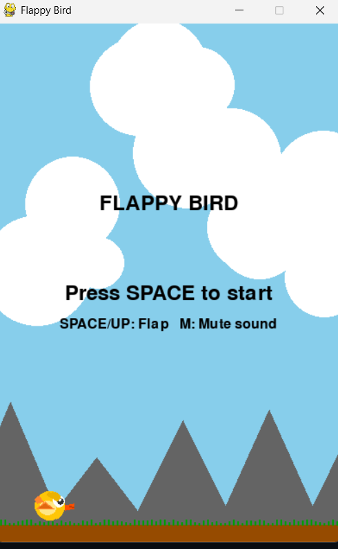
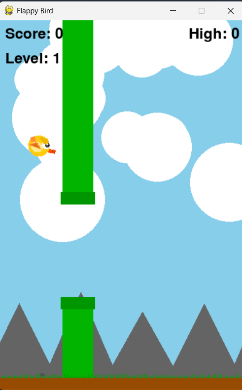

# Flappy Bird — Python Pygame Edition 🐦🎮

A visually enhanced and modern version of the classic Flappy Bird game, built using **Python** and **Pygame**. Fly through colorful pipes, experience changing skies from day to night, and enjoy fluid bird animations with sound effects and parallax scrolling backgrounds.

## 🎥 Preview

| Start Screen | In-Game |
|-------------|---------|
|  |  |

## 🛠 Features

- 🌄 **Dynamic background** with day, sunset, and night cycles.
- 🐤 **Animated bird** with blinking eyes, wing motion, crest feathers, and detailed design.
- 🌬️ **Parallax scrolling** background with mountains and clouds.
- 🎯 **Progressive difficulty** with faster pipes and tighter gaps as your score increases.
- 🌟 **Golden Pipes** appear occasionally for bonus points.
- 💥 **Particles and visual effects** for flapping, scoring, and collision.
- 🔈 **Sound effects** and background music (can be muted).
- 🎮 **Controls**:
  - `SPACE` or `UP ARROW`: Flap
  - `M`: Mute/Unmute Sound

